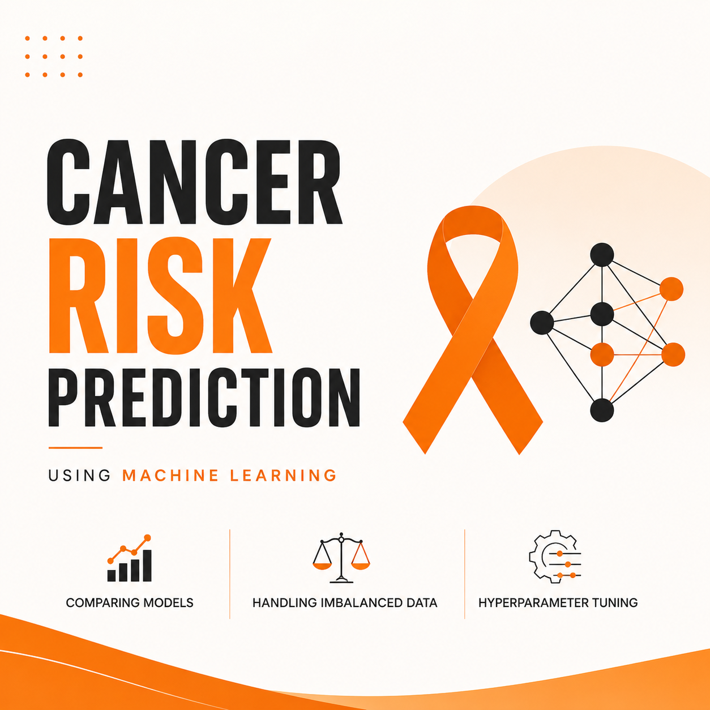

# 🩺 Cancer Risk Prediction using Machine Learning


<p align="center">
  
</p>


> An end-to-end Machine Learning pipeline for predicting cancer risk using patient health and lifestyle features.

---

## 📌 Overview

This project focuses on building and comparing multiple machine learning models for cancer risk prediction. Instead of relying on a single algorithm, different classification models, data balancing techniques, and hyperparameter tuning methods were evaluated to identify the best-performing pipeline.

---

## 🚀 Project Workflow

```
Dataset
   ↓
Exploratory Data Analysis (EDA)
   ↓
Data Cleaning
   ↓
Feature Scaling
   ↓
Model Comparison (12 Models)
   ↓
Class Imbalance Handling
   ↓
Hyperparameter Tuning
   ↓
Final Model Selection
```

---

## 📊 Models Compared

- Logistic Regression
- Decision Tree
- Random Forest
- Naive Bayes
- Support Vector Machine
- K-Nearest Neighbors
- Gradient Boosting
- AdaBoost
- XGBoost
- Bagging
- Linear Discriminant Analysis
- Quadratic Discriminant Analysis

---

## ⚖️ Handling Class Imbalance

The following techniques were compared:

- SMOTE
- RandomOverSampler
- ADASYN

RandomOverSampler achieved the best overall performance on this dataset.

---

## 🏆 Best Pipeline

```
RandomOverSampler
        ↓
GridSearchCV
        ↓
AdaBoost
```

---

## 📈 Final Results

| Metric | Score |
|--------|-------|
| Accuracy | **96.29%** |
| Precision | **0.96** |
| Recall | **0.97** |
| F1 Score | **0.96** |

---

## 🛠️ Technologies Used

- Python
- Pandas
- NumPy
- Matplotlib
- Seaborn
- Scikit-learn
- Imbalanced-learn
- XGBoost

---

## 📂 Project Structure

```
Cancer-Risk-Prediction-ML
│
├── dataset
├── notebook
├── images
├── README.md
├── requirements.txt
└── LICENSE
```

---

## 📌 Future Improvements

- SHAP Explainability
- LIME Explainability
- Streamlit Deployment
- Feature Importance Dashboard

---

⭐ If you found this project useful, consider giving it a star.
